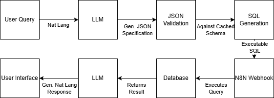

# RAG Query System

A reference implementation of a Retrieval-Augmented Generation (RAG) powered chat interface for database querying. This system converts natural language questions to SQL, executes them against a database, and returns natural language responses.

## System Architecture



The application consists of three main components:

1. **React Frontend**: A chat interface for interacting with the database
2. **Node.js Backend**: An Express server that processes queries and integrates with OpenAI
3. **n8n Workflow**: Handles database operations and query execution

## Features

- Convert natural language to SQL queries using OpenAI
- Dynamic database schema discovery (works with any MySQL database)
- Schema-aware query generation
- Audit logging of all queries
- JSON export of query results
- Error handling and query validation

## Prerequisites

- Node.js 16+
- MySQL 8.0+ database
- OpenAI API key
- n8n for workflow automation

## Setup Instructions

### 1. Database Setup

1. Create a MySQL database (local or cloud-hosted)
2. Create required tables using the script in `db/schema.sql`
3. Update your `.env` file with the database connection details 

### 2. n8n Setup

1. Sign up and log in to n8n Cloud at https://cloud.n8n.io.
2. Navigate to your n8n Cloud workspace.
3. Import the workflow file from n8n/database-query-executor.json.
4. Configure the MySQL credentials to connect to your database.
5. Activate the workflow.

### 3. Backend Setup

1. Install dependencies:
   ```bash
   npm install
   ```

2. Copy `.env.example` to `.env` and update with your settings:
   ```bash
   cp .env.example .env
   ```

3. Update the following in your `.env` file:
   - `DB_HOST`, `DB_USER`, `DB_PASS`, and `DB_NAME` with your database details
   - `OPENAI_API_KEY` with your OpenAI API key
   - `N8N_WEBHOOK_URL` with your n8n webhook URL (typically http://localhost:5678/webhook/execute-query)

4. Test the database connection:
   ```bash
   npm run db:refresh
   ```

5. Test the n8n connection:
   ```bash
   npm run n8n:test
   ```

6. Start the development server:
   ```bash
   npm run dev
   ```

### 4. Frontend Setup

The backend includes a simple HTML/JS frontend in the `public` directory that will be served automatically when you start the backend server. Access it at:

http://localhost:3001

For a more advanced React-based frontend, follow these steps:

1. Clone this repository
2. Navigate to a new directory and create a React app:
   ```bash
   npx create-react-app rag-query-frontend
   cd rag-query-frontend
   ```

3. Install additional dependencies:
   ```bash
   npm install axios react-syntax-highlighter react-json-view uuid tailwindcss @tailwindcss/forms
   ```

4. Set up Tailwind CSS:
   ```bash
   npx tailwindcss init -p
   ```

5. See the `frontend/README.md` for additional setup details and component examples

### 5. Testing the System

1. Start all components (database, n8n, backend)
2. Access the frontend at http://localhost:3001
3. Try asking questions like:
   - "Show me all active users"
   - "When did John Doe last log in?"
   - "How many users have we had since October 2023?"

## Configuration Options

### Environment Variables

| Variable | Description | Default |
|----------|-------------|---------|
| PORT | Server port | 3001 |
| NODE_ENV | Environment (development/production) | development |
| DB_HOST | Database hostname | localhost |
| DB_USER | Database username | root |
| DB_PASS | Database password | |
| DB_NAME | Database name | rag_test_db |
| DB_PORT | Database port | 3306 |
| DB_SSL | Use SSL for database connection | true |
| N8N_WEBHOOK_URL | n8n webhook URL | http://localhost:5678/webhook/execute-query |
| OPENAI_API_KEY | OpenAI API key | |
| OPENAI_MODEL | OpenAI model to use | gpt-4 |
| LOG_LEVEL | Logging level | info |
| LOG_DIRECTORY | Directory for log files | logs |

## API Reference

### Chat Endpoint

```
POST /api/chat
```

Request body:
```json
{
  "message": "Show me all active users",
  "conversationId": "optional-conversation-id"
}
```

Response:
```json
{
  "message": "Here are the active users in the system...",
  "sql": "SELECT * FROM users WHERE is_active = TRUE LIMIT 100",
  "data": [...],
  "conversationId": "uuid-conversation-id"
}
```

### Schema Endpoint

```
GET /api/chat/schema
```

Response:
```json
{
  "schema": {
    "tables": [...]
  }
}
```

### Raw Query Endpoint

```
POST /api/chat/query
```

Request body:
```json
{
  "query": "SELECT * FROM users WHERE is_active = TRUE"
}
```

Response:
```json
{
  "results": [...],
  "metadata": {
    "rowCount": 5,
    "executionTime": 0.123
  }
}
```
